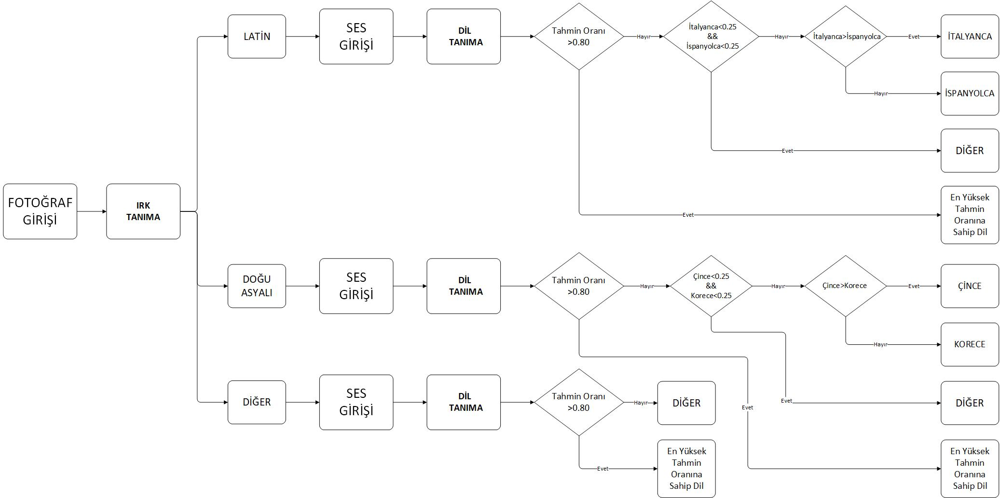
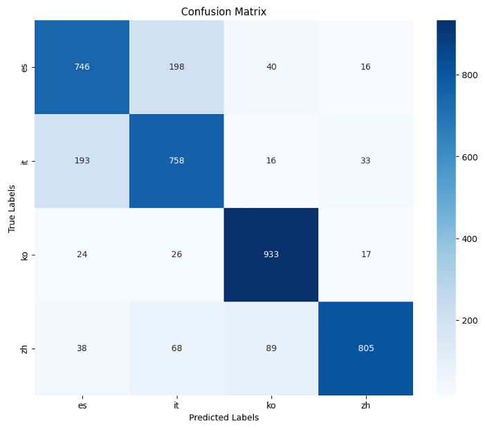
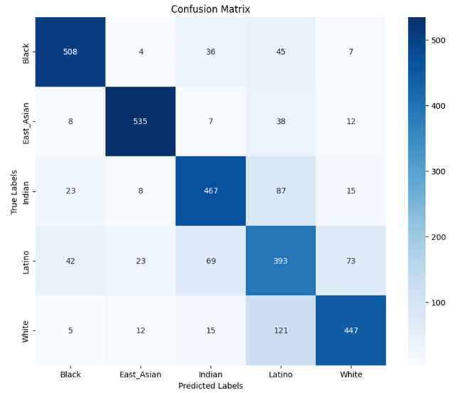
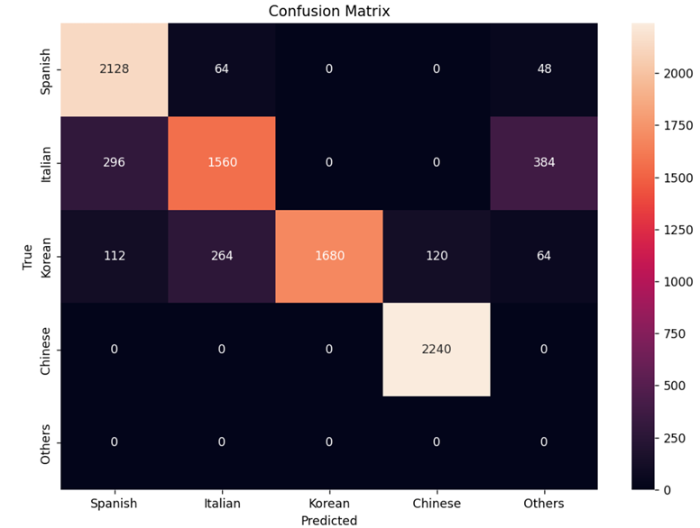
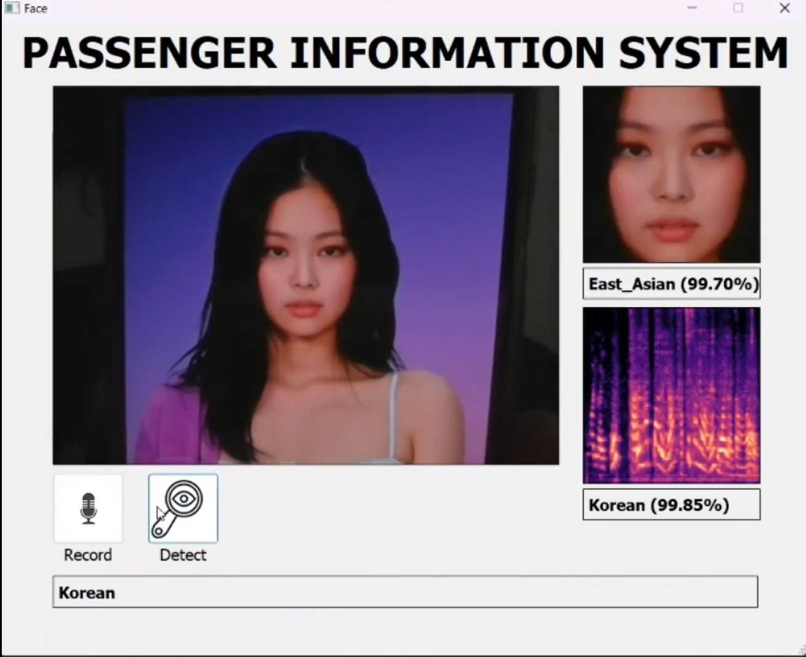

# Language and Race Detection System

## Overview
This project combines advanced deep learning techniques to predict the language spoken by a user and their race based on voice recordings and images. By processing both audio and image inputs, the system aims to output a tailored message welcoming users in their predicted language, such as "Welcome to the airport" in various languages (e.g., Korean, Spanish, Chinese, etc.).

## Project Details
- **Created by**: Burak Okur and Ibrahim Halil Ozcakir
- **Creation Date**: 2024-06-18

## Preprocessing Steps for Race Detection
1. Face and Eye Detection
2. Cropping
3. Resizing
4. Normalization

## Preprocessing Steps for Language Detection
1. Noise Removal
2. Removal of Empty Data
3. Creating 5-second Audio Clips
4. Normalization
5. Conversion to Spectrogram

## Datasets
- The dataset used for the language recognition system is **VoxLingua107**, an open-source compilation of speech clips from various languages contributed by users.
- The dataset for race recognition is **FairFace: Face Attribute Dataset**, created by Kärkkäinen and Joo, which provides a diverse set of images to ensure fair and accurate racial classification across multiple categories.

## Technology Used
- The system uses the **YOLOv8** model for deep learning in image processing to detect race from a live camera feed and applies audio processing libraries to extract features from the user's speech for language detection. Based on these two inputs, the system generates a language prediction and displays a greeting in the user's predicted language.

## Accuracy Rates
- **Language Detection**: 83%
- **Race Detection**: 80%
- **Combined Accuracy**: 85%

## Predicted Languages
- **Korean**: "공항에 오신 것을 환영합니다"
- **Spanish**: "Bienvenido al aeropuerto"
- **Chinese**: "欢迎来到机场"
- **Italian**: "Benvenuto all'aeroporto"
- **Others**: "Welcome to the airport"

## Conclusion
This project serves as a starting point for integrating language and facial recognition into larger applications. Feel free to modify and expand this code for your needs. 

## Contact
For any questions or suggestions, contact me at [burak1837burak@gmail.com].

## Visualizations

- **Algorithm**:  
  

- **Language Confusion Matrix**:  
  

- **Race Confusion Matrix**:  
  

- **Overall Confusion Matrix**:  
  

- **Demo Presentation**:  
  

